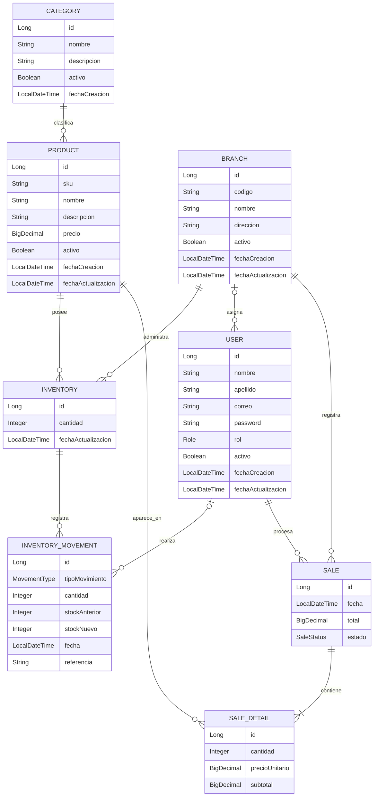

# RetailOps — Diagrama del Modelo de Dominio

## 1. Objetivo

Representar visualmente el modelo de dominio inicial de RetailOps y las relaciones existentes entre las principales entidades del sistema.

El diagrama permite comprender cómo se conectan productos, categorías, sucursales, inventario, movimientos de inventario, ventas, detalles de venta y usuarios antes de comenzar la implementación con Spring Boot, JPA y PostgreSQL.

---

## 2. Entidades del dominio

El modelo inicial está compuesto por las siguientes entidades:

- Producto (`Product`)
- Categoría (`Category`)
- Sucursal (`Branch`)
- Inventario (`Inventory`)
- Movimiento de inventario (`InventoryMovement`)
- Venta (`Sale`)
- Detalle de venta (`SaleDetail`)
- Usuario (`User`)

---

## 3. Diagrama entidad-relación



---

## 4. Relaciones principales

| Entidad A | Cardinalidad | Entidad B | Descripción |
|---|---|---|---|
| Categoría | 1 : N | Producto | Una categoría puede clasificar varios productos. |
| Producto | 1 : N | Inventario | Un producto puede tener inventario en varias sucursales. |
| Sucursal | 1 : N | Inventario | Una sucursal mantiene múltiples registros de inventario. |
| Inventario | 1 : N | Movimiento de inventario | Un inventario puede registrar múltiples movimientos de stock. |
| Usuario | 1 : N | Movimiento de inventario | Un usuario puede realizar múltiples movimientos cuando corresponda. |
| Sucursal | 1 : N | Usuario | Una sucursal puede tener varios usuarios asignados. |
| Sucursal | 1 : N | Venta | Una sucursal puede registrar múltiples ventas. |
| Usuario | 1 : N | Venta | Un usuario puede procesar múltiples ventas. |
| Venta | 1 : N | Detalle de venta | Una venta contiene uno o más productos vendidos. |
| Producto | 1 : N | Detalle de venta | Un producto puede aparecer en múltiples ventas. |

---

## 5. Modelo conceptual simplificado

```text
                         CATEGORÍA
                             │
                            1:N
                             │
                             ▼
                          PRODUCTO
                         /        \
                        /          \
                      1:N          1:N
                      /              \
                     ▼                ▼
               INVENTARIO      DETALLE DE VENTA
                ▲    │                ▲
                │    │                │
                │   1:N              N:1
                │    │                │
                │    ▼              VENTA
                │ MOVIMIENTO           ▲
                │ DE INVENTARIO        │
                │    ▲                 │
                │    │                 │
                │ USUARIO ─────────────┘
                │    ▲
                │    │
                └─ SUCURSAL
```

---

## 6. Explicación del diseño

### Producto y categoría

Cada producto pertenece a una categoría.

Ejemplo:

```text
Categoría: Bebidas

- Coca-Cola 500 ml
- Inca Kola 500 ml
- Agua San Mateo
```

Una categoría puede contener muchos productos, mientras que cada producto pertenece inicialmente a una sola categoría.

---

### Producto, sucursal e inventario

El stock no pertenece directamente al producto.

RetailOps es un sistema multisucursal, por lo que un mismo producto puede tener diferentes cantidades disponibles dependiendo de la sucursal.

Ejemplo:

```text
Coca-Cola 500 ml

San Borja     -> 15 unidades
Surco         -> 8 unidades
Miraflores    -> 3 unidades
```

Por este motivo existe la entidad `Inventory`.

Conceptualmente:

```text
Producto + Sucursal = Inventario
```

Además, la combinación entre producto y sucursal debe ser única.

```text
UNIQUE(producto_id, sucursal_id)
```

Esto evita situaciones como:

```text
Coca-Cola + San Borja -> 15
Coca-Cola + San Borja -> 20
```

El sistema debe mantener un único registro de inventario para esa combinación.

---

### Inventario y movimientos

Cada cambio realizado sobre el stock debe generar un movimiento de inventario.

Ejemplo:

```text
Stock inicial: 20

+10  Reposición
-3   Venta
-2   Ajuste

Stock final: 25
```

La entidad `InventoryMovement` permitirá registrar:

- tipo de movimiento;
- cantidad modificada;
- stock anterior;
- stock nuevo;
- fecha;
- usuario responsable;
- referencia de la operación.

Esto permite mantener trazabilidad sobre los cambios del inventario.

---

### Sucursal y usuario

Una sucursal puede tener varios usuarios operativos.

Ejemplo:

```text
Sucursal San Borja

- Manager
- Cajero 1
- Cajero 2
```

Para la primera versión del sistema, los usuarios operativos estarán asociados a una sucursal.

El rol `ADMIN` podrá no estar asociado a una sucursal específica.

---

### Venta y usuario

Toda venta debe identificar al usuario responsable de procesarla.

Ejemplo:

```text
Venta #1025

Sucursal: San Borja
Usuario: cajero01
Fecha: 24/09/2026
Total: S/ 25.50
```

Esto permite mantener trazabilidad sobre quién realizó cada operación.

---

### Venta y detalle de venta

Una venta puede contener uno o varios productos.

Por este motivo se utiliza `SaleDetail`.

Ejemplo:

```text
VENTA #1025

Detalle 1
Producto: Coca-Cola
Cantidad: 2
Precio unitario: S/ 3.50
Subtotal: S/ 7.00

Detalle 2
Producto: Chocolate
Cantidad: 3
Precio unitario: S/ 2.50
Subtotal: S/ 7.50
```

La relación permite representar:

```text
VENTA
  │
  ├── DETALLE 1
  ├── DETALLE 2
  └── DETALLE 3
```

---

## 7. Conservación del precio histórico

El precio utilizado durante una venta debe almacenarse dentro de `SaleDetail`.

Ejemplo:

```text
24/09/2026

Producto:
Coca-Cola

Precio actual:
S/ 3.50
```

Se realiza una venta:

```text
precioUnitario = S/ 3.50
```

Posteriormente el precio cambia:

```text
Producto.precio = S/ 4.00
```

La venta anterior debe continuar mostrando:

```text
S/ 3.50
```

Esto permite conservar correctamente la información histórica de las ventas.

---

## 8. Trazabilidad

RetailOps debe permitir identificar el origen de las operaciones importantes.

El modelo debe permitir responder preguntas como:

- ¿qué producto cambió de stock?
- ¿en qué sucursal ocurrió?
- ¿cuánto stock había antes?
- ¿cuánto stock quedó después?
- ¿qué tipo de movimiento ocurrió?
- ¿qué usuario realizó la operación?
- ¿qué venta generó el movimiento?
- ¿cuándo ocurrió?

La entidad `InventoryMovement` será responsable de conservar gran parte de esta información.

---

## 9. Desactivación lógica

Las entidades principales no deberán eliminarse físicamente cuando exista información histórica relacionada.

Las siguientes entidades utilizarán un estado lógico mediante el atributo:

```text
activo
```

Principalmente:

- Producto
- Categoría
- Sucursal
- Usuario

Por ejemplo:

```text
Producto

activo = true
```

puede pasar a:

```text
activo = false
```

sin eliminar las ventas históricas donde ese producto haya participado.

---

## 10. Enumeraciones previstas

Durante la implementación se crearán enumeraciones para representar estados y tipos controlados.

### Role

```text
ADMIN
MANAGER
CASHIER
```

### MovementType

```text
REPLENISHMENT
SALE
ADJUSTMENT_IN
ADJUSTMENT_OUT
```

### SaleStatus

```text
COMPLETED
CANCELLED
```

Estas enumeraciones podrán ampliarse posteriormente según las nuevas necesidades del proyecto.

---

## 11. Restricciones principales

El modelo deberá respetar inicialmente las siguientes restricciones:

```text
Product.sku
UNIQUE
NOT NULL
```

```text
Branch.codigo
UNIQUE
NOT NULL
```

```text
User.correo
UNIQUE
NOT NULL
```

```text
Inventory
UNIQUE(producto_id, sucursal_id)
```

```text
Inventory.cantidad >= 0
```

```text
Product.precio > 0
```

```text
SaleDetail.cantidad > 0
```

```text
SaleDetail.precioUnitario > 0
```

---

## 12. Decisiones principales del modelo

### El producto no almacena stock

El stock depende de la sucursal.

Por ese motivo:

```text
Product.stock
```

no formará parte del modelo.

Se utilizará:

```text
Inventory
```

---

### El detalle conserva el precio de venta

`SaleDetail` almacena `precioUnitario` para conservar el precio histórico de cada operación.

---

### Los movimientos conservan trazabilidad

Cada modificación del stock debe quedar registrada mediante `InventoryMovement`.

---

### Se evita eliminar información histórica

Los registros principales podrán desactivarse utilizando estados lógicos en lugar de eliminarse físicamente.

---

## 13. Alcance de la versión inicial

Este modelo representa la primera versión del dominio de RetailOps.

Durante el desarrollo podrán surgir nuevos requerimientos que obliguen a evolucionar el diseño.

No se incluyen todavía:

- proveedores;
- órdenes de compra;
- clientes;
- promociones;
- devoluciones avanzadas;
- transferencias entre sucursales;
- múltiples sucursales por usuario;
- facturación electrónica.

Estas funcionalidades podrán evaluarse en versiones posteriores.

---

## 14. Estado

Modelo de dominio y relaciones iniciales documentados.

**Ticket relacionado:** `RETAILOPS-002`

**Estado:** Aprobado para revisión técnica.
